# Global Variables n8n Node

> Inspired by `n8n-nodes-globals`
>
> https://github.com/umanamente/n8n-nodes-globals
>
> _At the time of creation of `n8n-nodes-global-variables`, `n8n-nodes-globals` didn't support JSON variables._  
> _And even still I enjoy being able to organize my variables into multiple named variables._  
> _Personal preference!_

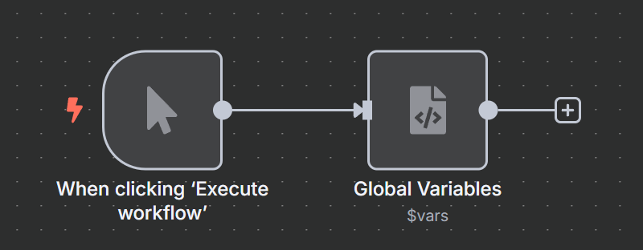

# Install `n8n-nodes-global-variables`

> Requires self-hosted n8n

# How it works

## 1. Create a `Global Variables` credential

> Note: you can have as many of these as you want to organize your variables.

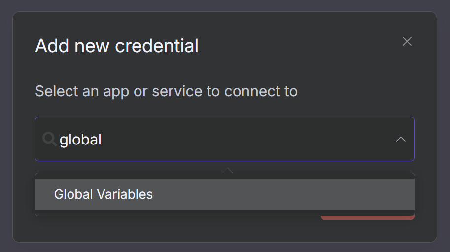

## 2. Add some variables with names and values

> The credential stores up to 10 named variables with values.
>
> _Note: I found that up to 50 work, but it slows down loading of the credential UI. Fork the code if you want up to 50._
>
> If you want to organize your variables into more than 10 named variables, you can create multiple credentials.

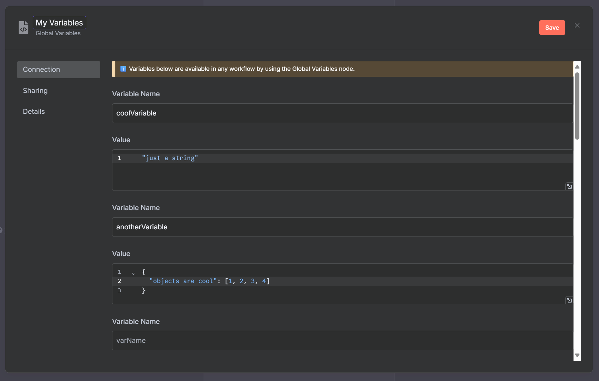

## 3. Add a `Global Variables` node in your workflow

> Choose the credential you created in step 1.

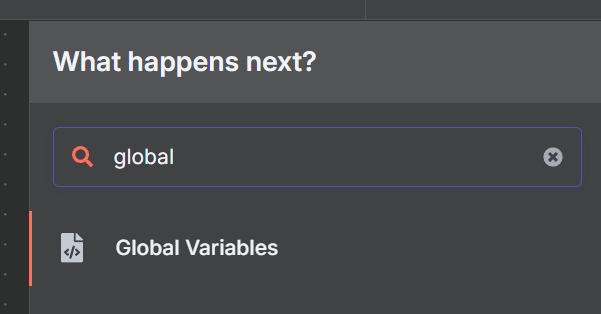

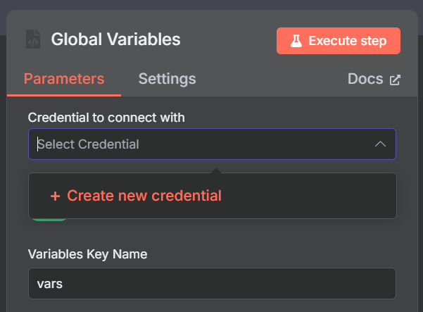

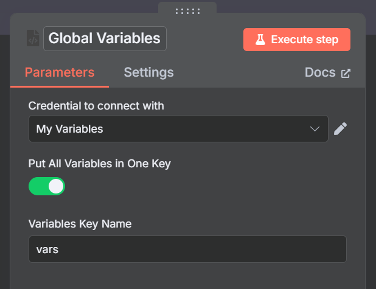

## That's it!

Wherever the node is used, its variables will be available in the workflow after the node is executed in `$json`.

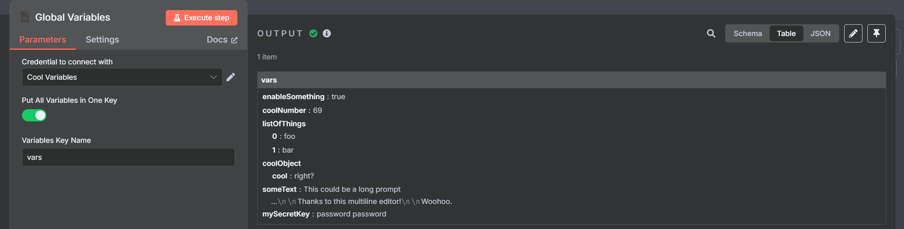

### `$json.vars.X`

If you choose `Put All Variables in One Key` in the node options, all variables will be available under the `$json.<the name you chose>` key.

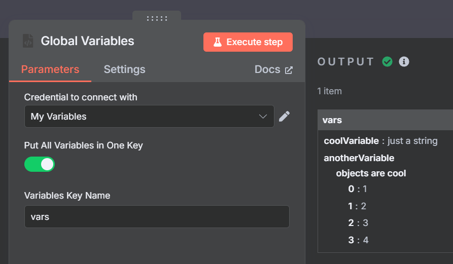

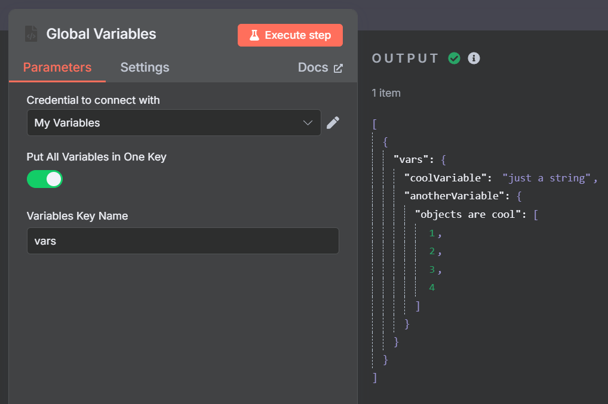

### `$json.X`

If you disable `Put All Variables in One Key` in the node options, each variable will be available under its own key in `$json`.

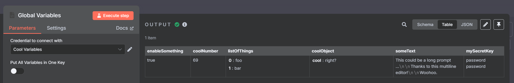

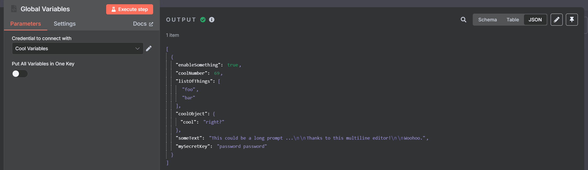

## Does not overwrite existing variables

If you have existing variables in your workflow, the `Global Variables` node will not overwrite them.

It will only add the variables that are defined in the credential.

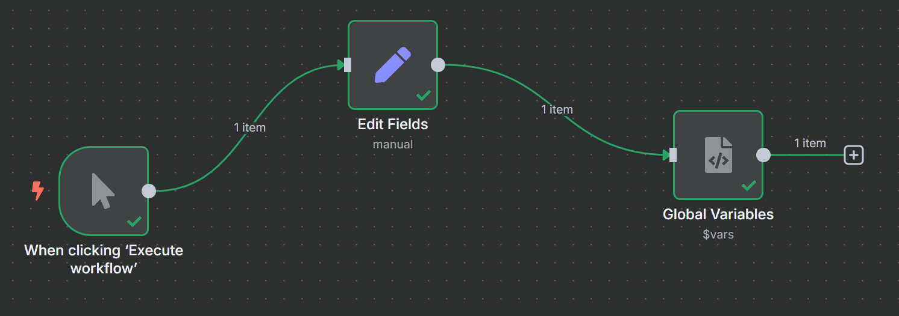

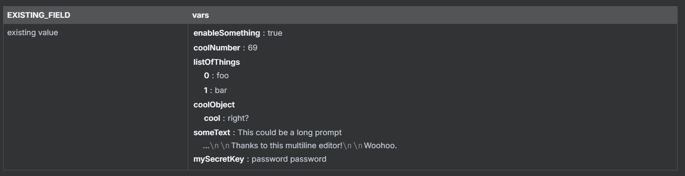

## Expressions

Expressions such as `{{ $json.foo }}` work as expected!

So long as `$json.foo` is available before the `Global Variables` node is executed.

# Attribution

This node is inspired by the `n8n-nodes-globals` node by [Umanamente](https://github.com/umanamente).
>
> https://github.com/umanamente/n8n-nodes-globals
>
> License MIT
